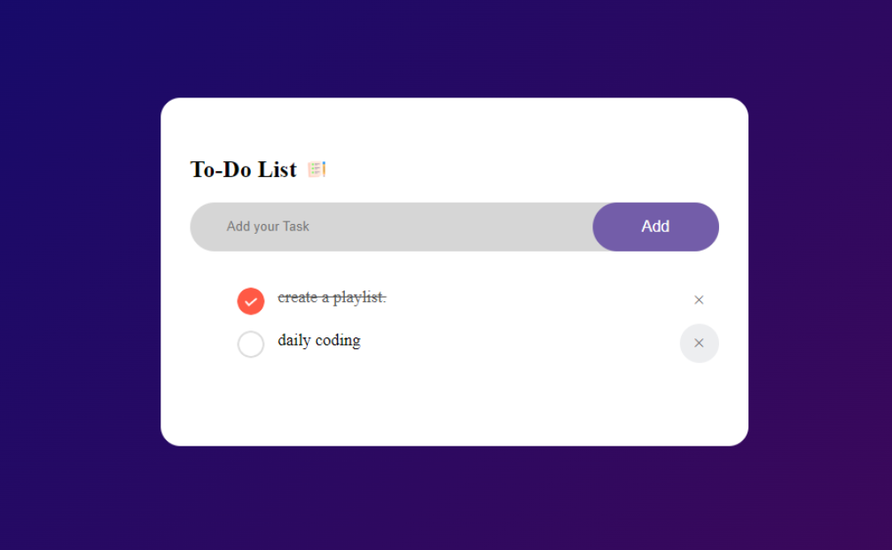
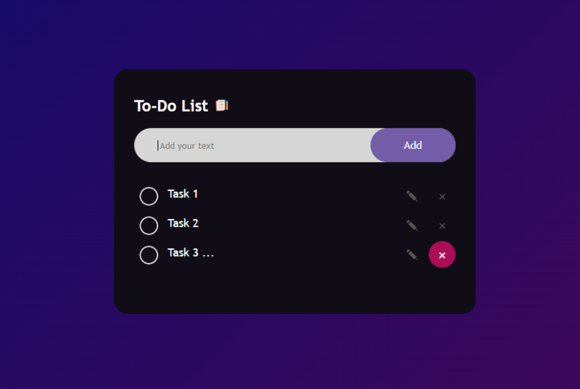
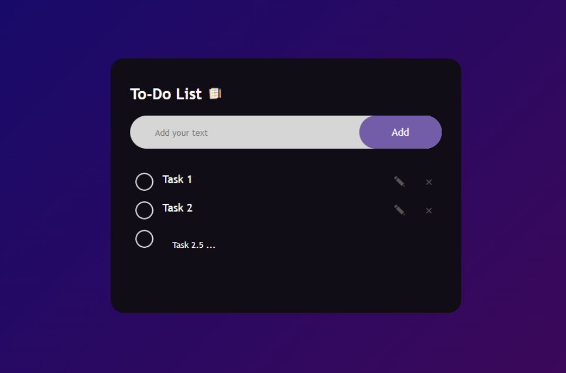
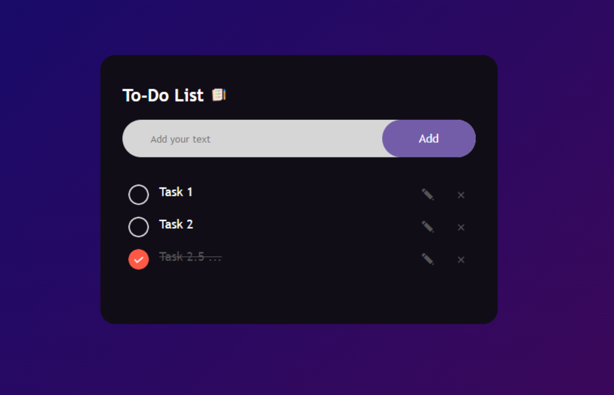

# To-Do List App

A minimalistic To-Do List app built with HTML, CSS, and JavaScript, featuring browser's local storage for saving tasks.

## Features

- Add and manage tasks.
- Save tasks in the browser's local storage for persistence.
- Mark tasks as completed.
- Delete tasks.
- Simple and intuitive user interface.

## Demo

[Live Demo](https://1zhann.github.io/To-do-App/)

## Usage

1. Add a task: Enter a task in the input field and press `Enter` or click the "Add" button.
2. Mark as completed: Click on a task to mark it as completed.
3. Delete a task: Click the "X" button next to a task to remove it from the list.

## Iterations

#### Iteration 1 (Initial Version)

- [x] Basic HTML structure for the app.
- [x] Add functionality to add and display tasks.
- [x] Implement task completion and deletion.

#### Iteration 2 (Styling Improvements and Editing Button)

- [x] Added Editing Task option (button) 
- [x] Improve the user interface with CSS styling.
- [x] Optimize layout and spacing.
- [x] Store tasks in the browser's local storage.

# Courtesy
<https://www.youtube.com/watch?v=G0jO8kUrg-I&ab_channel=GreatStack>

